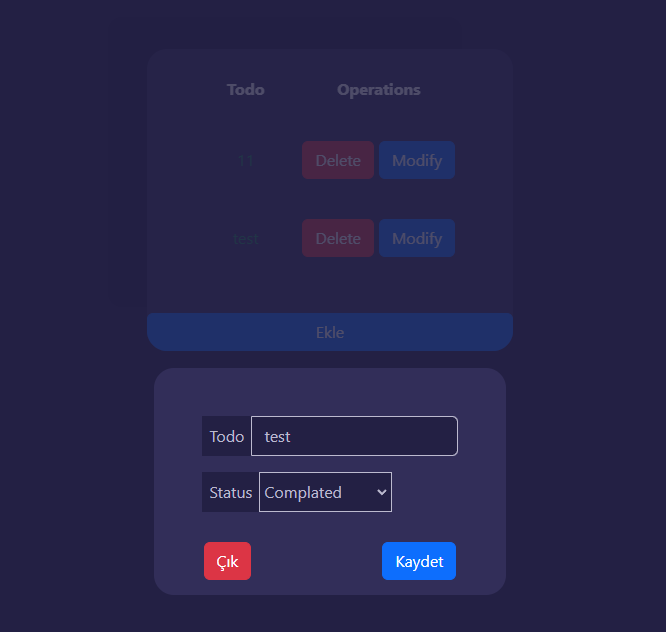

# Todo Application with Laravel & ES6

## About the Application
This application allows users to create, update, and delete to-do lists dynamically without any page refresh, utilizing the capabilities of ES6. The project is built using Laravel 9 and ES6.



## How to Build the Application

1. Clone the repository:
    ```bash
    git clone https://github.com/remzikilnc/todo-with-laravel.git
    ```
2. Navigate to the project directory:
    ```bash
    cd todo-with-laravel
    ```
3. Install dependencies:
    ```bash
    composer install
    ```
4. Create a copy of your `.env` file:
    ```bash
    cp .env.example .env
    ```
5. Generate an application key:
    ```bash
    php artisan key:generate
    ```
6. Run the application:
    ```bash
    php artisan serve
    ```
   Now, you should be able to access the application at http://localhost:8000

## Live Application
Experience the live version of the application and explore its functionalities through the following link:

[Live Application](http://www.laravel-with-es6-todo.remzikilinc.com/)

